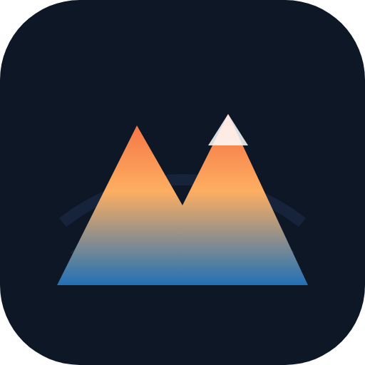
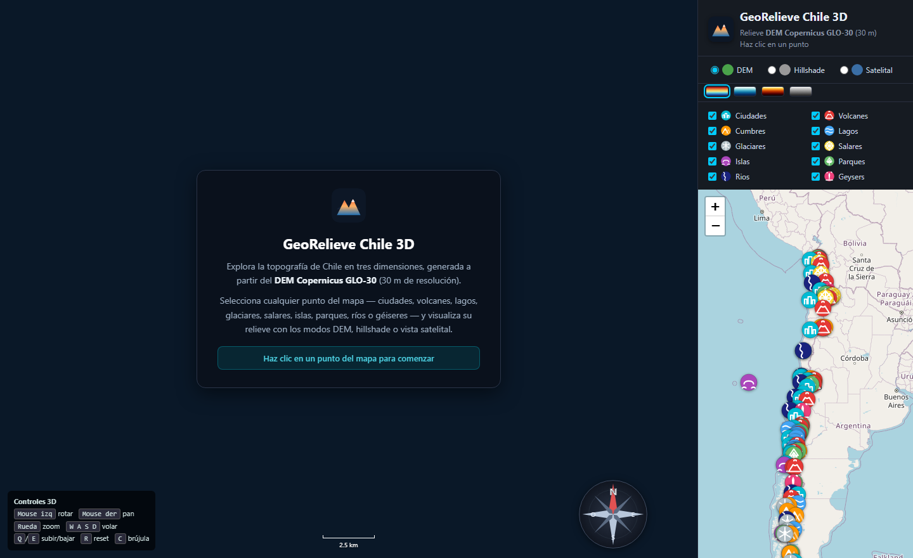
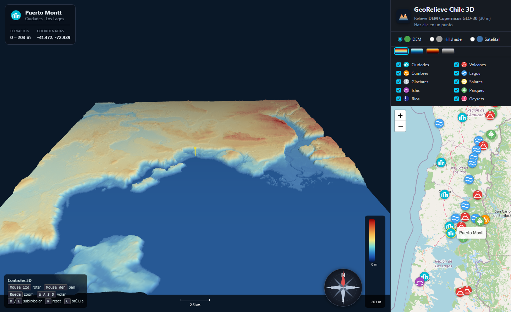

<p align="center">
  
</p>

<h1 align="center">GeoRelieve Chile 3D</h1>

<p align="center">
  Explorador interactivo del relieve de Chile en 3D, construido sobre el <strong>DEM Copernicus GLO-30</strong> (30 m de resolución).
</p>

---

## ¿Qué es?

**GeoRelieve Chile 3D** es una aplicación web que te permite explorar la topografía de Chile en tres dimensiones. Elige cualquier punto del mapa — ciudades, volcanes, lagos, glaciares, salares, islas, parques, ríos y géiseres — y visualiza su relieve al instante, con la posibilidad de alternar entre tres modos: **DEM** (hipsométrico + sombreado), **hillshade** (sombreado en grises) y **vista satelital** (imagen real).

## Capturas

<p align="center">
  
  <br><em>Pantalla de bienvenida: mapa de Chile con 107 puntos categorizados y filtros.</em>
</p>

<p align="center">
  
  <br><em>Vista 3D del relieve de Puerto Montt, con pin de ubicación, brújula, escala y tarjeta de información.</em>
</p>

## Características

- 🗺️ **Catálogo de 107 puntos** en 10 categorías (ciudades, volcanes, cumbres, lagos, glaciares, salares, islas, parques, ríos y géiseres) con filtros por tipo.
- 🏔️ **Tres modos de visualización:** DEM coloreado, hillshade (sombreado) y satelital.
- 🎨 **Cuatro paletas de color** para el relieve (terreno, batimétrica, fuego y grises).
- 🖱️ **Navegación 3D completa:** rotar, hacer zoom, volar (WASD) y orientación con brújula.
- 📏 **Escala de distancia** dinámica y **pin 3D** sobre el punto seleccionado.
- 💾 **Descarga automática del DEM** con caché local (la primera vez tarda, después es instantáneo).

## Tecnologías

| Capa | Tecnología |
|---|---|
| Backend | Python · Flask · GDAL |
| Visor 3D | Three.js |
| Mapa 2D | Leaflet |
| Datos | Copernicus DEM GLO-30 (30 m) · Esri World Imagery |

## Cómo ejecutar

**Requisitos:** Python 3.12 con `Flask`, `NumPy` y `GDAL` (puedes usar el Python incluido en QGIS, que ya trae GDAL).

```bash
pip install flask numpy
python app.py
```

Luego abre <http://localhost:8765/> en tu navegador.

> **Nota:** se requiere conexión a internet la primera vez que se visualiza cada zona (descarga los tiles del DEM desde AWS Open Data) y para cargar las librerías del navegador (Three.js, Leaflet).

## Estructura del proyecto

```
.
├── app.py              # Backend Flask (descarga + mosaico + sombreado del DEM)
├── catalog.json        # Catálogo de 107 puntos
├── requirements.txt
├── static/             # Frontend (HTML, CSS, JS, SVG)
│   ├── index.html
│   ├── style.css
│   ├── app.js          # Orquestador
│   ├── map.js          # Mapa Leaflet + filtros
│   ├── viewer.js       # Visor 3D (Three.js)
│   ├── categories.js   # Metadatos de categorías
│   ├── icons.js        # Iconos SVG por categoría
│   ├── compass.svg     # Brújula
│   └── favicon.svg     # Logo / favicon
└── assets/             # Imágenes del README
```

## Fuentes de datos

- **Relieve:** [Copernicus DEM GLO-30](https://registry.opendata.aws/copernicus-dem/) (Agencia Espacial Europea / Copernicus), 30 m, vía AWS Open Data.
- **Imagen satelital:** Esri World Imagery.
